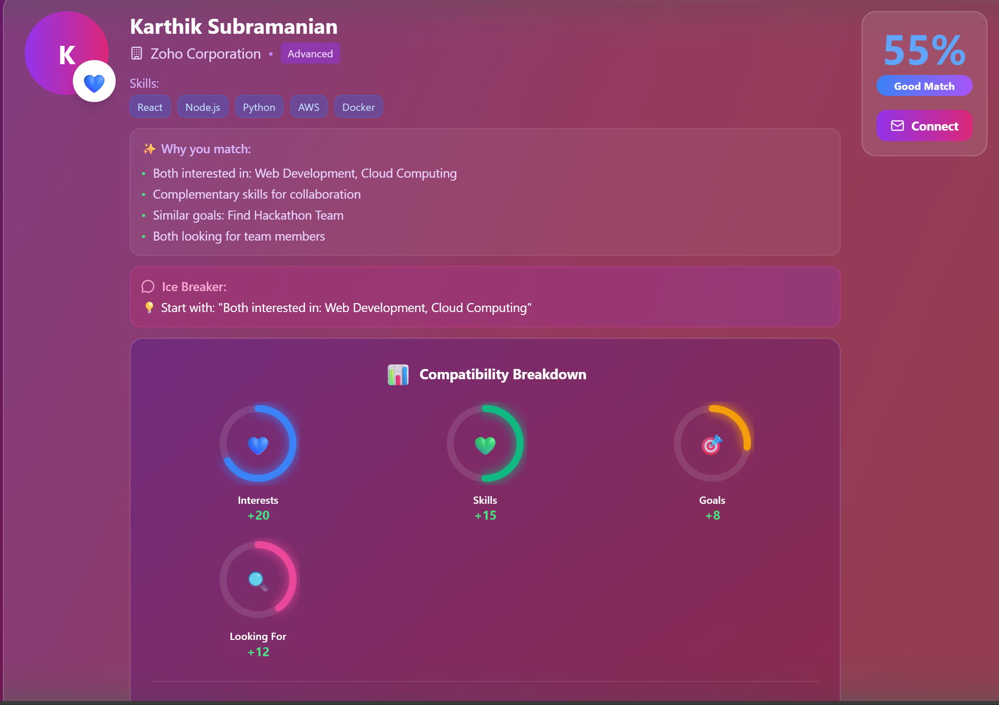
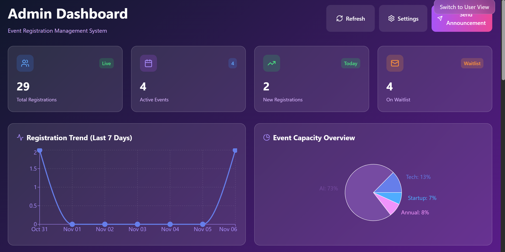
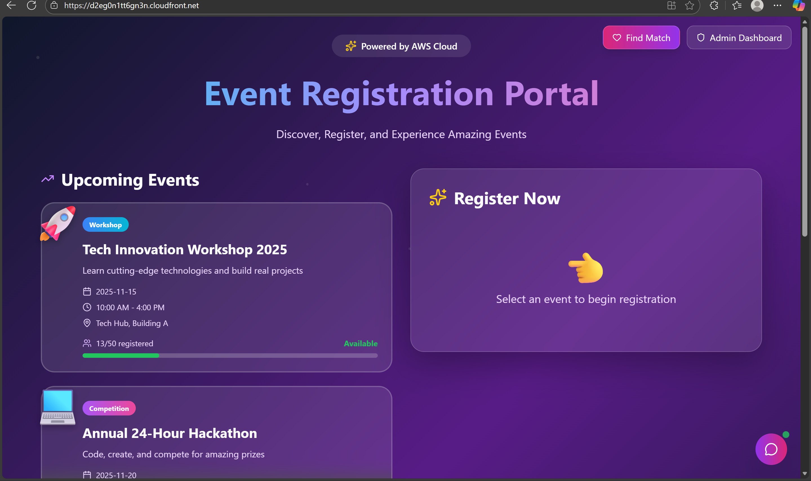
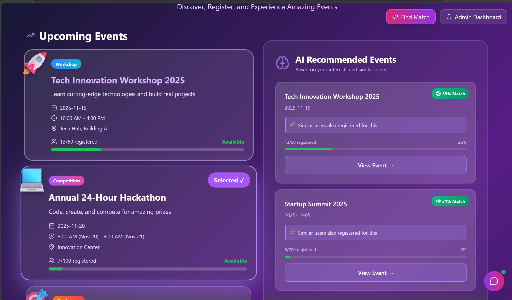
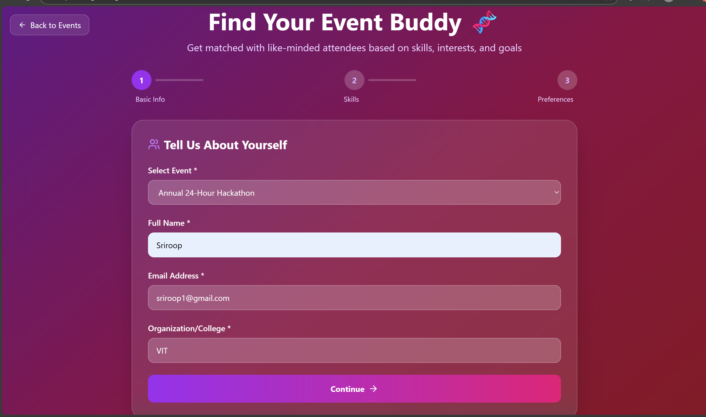
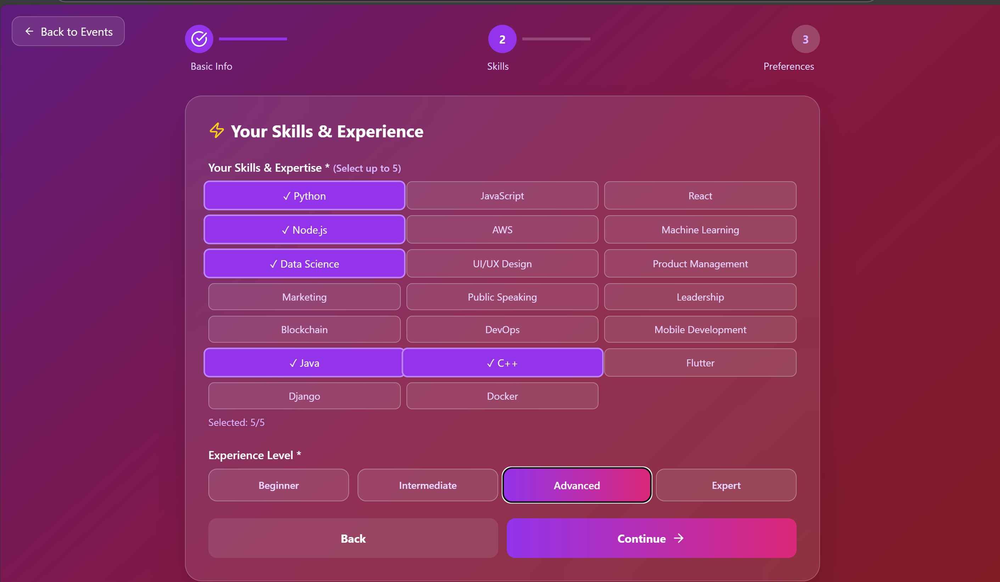
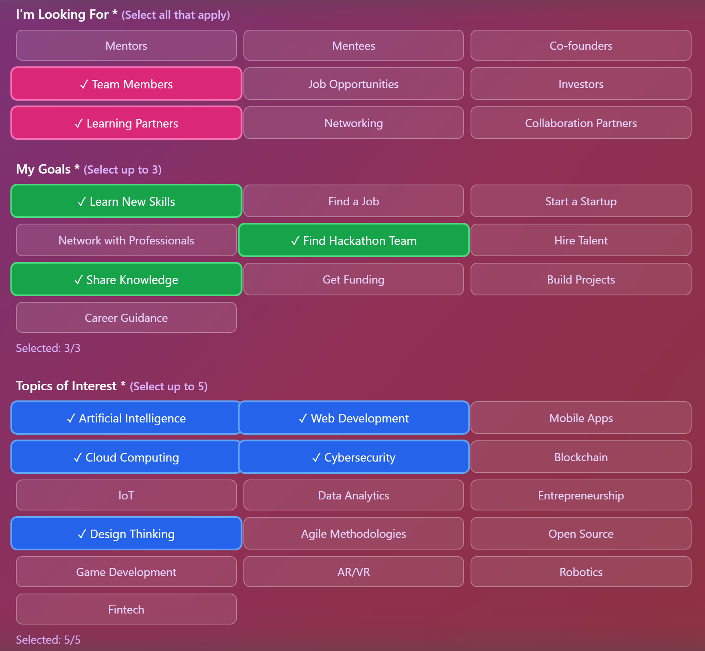
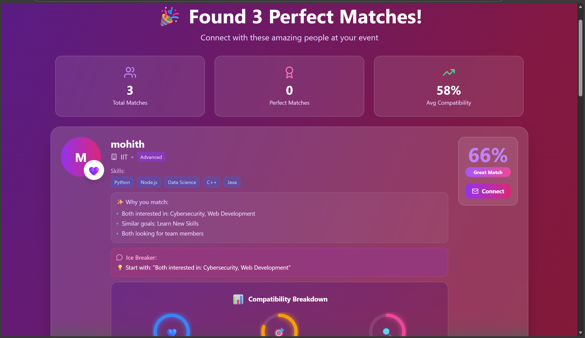

# 🧬 EventDNA: Serverless Event Registration System with AI-Powered Networking

<div align="center">

**Transform your events from simple registration to intelligent networking**

[](https://aws.amazon.com/)
[](https://reactjs.org/)
[](https://www.python.org/)
[](https://aws.amazon.com/dynamodb/)

[**Live Demo**](https://d2eg0n1tt6gn3n.cloudfront.net/) • [**Full Documentation**](docs/PROJECT_REPORT.pdf)

</div>

---

## Table of Contents

- [About The Project](#about-the-project)
- [Key Features](#key-features)
- [Architecture](#architecture)
- [Technology Stack](#technology-stack)
- [Getting Started](#getting-started)
- [Deployment Guide](#deployment-guide)
- [API Documentation](#api-documentation)
- [Screenshots](#screenshots)
- [Testing](#testing)
- [License](#license)
- [Links](#links)
- [Author](#author)

---

## About The Project

EventDNA is a **production-ready, intelligent event management platform** built entirely on **AWS serverless architecture**. It was developed to solve two critical problems in modern event management:

### Problems Solved

**Traditional Event Platforms Face:**

- **High operational costs:** Paying for idle servers 24/7
- **Poor scalability:** Crashes during ticket launches
- **High latency** for global audiences
- **Ineffective networking:** Attendees struggle to find valuable connections
- **Complex maintenance:** Constant server patching and updates

**EventDNA Solution:**

- **Pay-as-you-go pricing:** Scales to $0 when idle
- **Infinite auto-scaling:** Handles 10 or 10,000 users seamlessly
- **<500ms API response time** with a global CDN
- **AI-powered matchmaking:** Connects attendees with compatible peers, mentors, and collaborators
- **Zero server management:** Fully serverless and managed

---

## Key Features

### 1. AI "DNA" Matching System (Flagship Feature)

A proprietary matching algorithm that analyzes comprehensive user profiles to create meaningful connections:

**Multi-vector compatibility scoring:**

- **Shared Interests** (0-30 points)
- **Mentorship Matching** (0-25 points)
- **Goal Alignment** (0-25 points)
- **Looking For Match** (0-15 points)
- **Organization Diversity Bonus** (encourages new connections)

**Features:**

- Calculates compatibility scores between attendees
- Generates personalized "icebreaker" conversation starters
- Provides detailed match reasoning



---

### 2. AI Event Recommender

A hybrid recommendation engine combining 4 algorithms:

| Algorithm | Weight | Purpose |
|-----------|--------|---------|
| **Collaborative Filtering** | 40% | "Users like you also attended..." |
| **Category Matching** | 30% | Content-based similarity |
| **Popularity Ranking** | 20% | Trending events |
| **Urgency Score** | 10% | Events filling up fast (FOMO) |

---

### 3. NLP-Based AI Chatbot

A context-aware chatbot with intelligent intent recognition for 24/7 automated support:

- Natural language understanding
- Event-specific activity descriptions
- Fuzzy string matching for misspellings

---

### 4. Real-Time Admin Dashboard

A comprehensive analytics panel for event organizers to track:

- Total registrations and conversion rates
- User engagement metrics
- Event capacity monitoring
- Real-time attendance tracking



---

## Architecture

### System Architecture Diagram


### Architectural Components

```
┌─────────────────────────────────────────────────────────────┐
│                    FRONTEND LAYER                            │
│  ┌──────────────┐         ┌─────────────────────┐          │
│  │   React App  │────────▶│  Amazon CloudFront  │          │
│  │  (Static SPA)│         │   (Global CDN)      │          │
│  └──────────────┘         └─────────────────────┘          │
│         │                           │                        │
│         │                           ▼                        │
│         │                  ┌─────────────────┐              │
│         └─────────────────▶│   Amazon S3     │              │
│                             │ (Static Hosting)│              │
│                             └─────────────────┘              │
└─────────────────────────────────────────────────────────────┘
                               │
                               ▼
┌─────────────────────────────────────────────────────────────┐
│                      API LAYER                               │
│                ┌─────────────────────────┐                   │
│                │  Amazon API Gateway     │                   │
│                │  (RESTful API)          │                   │
│                └─────────────────────────┘                   │
└─────────────────────────────────────────────────────────────┘
                               │
        ┌──────────────────────┼──────────────────────┐
        ▼                      ▼                      ▼
┌─────────────────────────────────────────────────────────────┐
│                   COMPUTE LAYER (AWS Lambda)                 │
│  ┌─────────────┐  ┌─────────────┐  ┌─────────────┐         │
│  │  Register   │  │ Chatbot     │  │ MatchMaker   │         │
│  │  Function   │  │ Function    │  │ Function    │         │
│  └─────────────┘  └─────────────┘  └─────────────┘         │
│  ┌─────────────┐  ┌─────────────┐  ┌─────────────┐         │
│  │Recommender  │  │ Dashboard   │  │ Reminders   │         │
│  │ Function    │  │ Function    │  │ Function    │         │
│  └─────────────┘  └─────────────┘  └─────────────┘         │
└─────────────────────────────────────────────────────────────┘
                               │
        ┌──────────────────────┼──────────────────────┐
        ▼                      ▼                      ▼
┌─────────────────────────────────────────────────────────────┐
│                DATABASE LAYER (Amazon DynamoDB)              │
│  ┌─────────────┐  ┌──────────────┐  ┌──────────────┐       │
│  │   Events    │  │Registrations │  │  Matching    │       │
│  │   Table     │  │    Table     │  │  Profiles    │       │
│  └─────────────┘  └──────────────┘  └──────────────┘       │
│                                         (+ GSI: eventId)     │
└─────────────────────────────────────────────────────────────┘
```

### Request Flow

1. **User Request:** Hits **CloudFront** (nearest edge location)
2. **API Call:** **API Gateway** validates and routes the request
3. **Function Execution:** **AWS Lambda** processes all business logic
4. **Data Access:** **Amazon DynamoDB** returns data in <10ms
5. **Response:** JSON is returned through API Gateway to the user

---

## Technology Stack

### Cloud Infrastructure (AWS)

| Service | Purpose | Why We Use It |
|---------|---------|---------------|
| **Amazon S3** | Static website hosting | Infinitely scalable, 99.999999999% durability |
| **Amazon CloudFront** | Global CDN | <50ms latency worldwide, automatic HTTPS |
| **Amazon API Gateway** | RESTful API management | Managed service, built-in throttling & caching |
| **AWS Lambda** | Serverless compute | Auto-scaling, pay-per-execution, no servers |
| **Amazon DynamoDB** | NoSQL database | Single-digit ms latency, auto-scaling |
| **Amazon SES** | Email service | 99% deliverability, cost-effective |
| **AWS IAM** | Security & permissions | Fine-grained access control |
| **Amazon CloudWatch** | Monitoring & logging | Real-time metrics and debugging |

### Application Stack

- **Frontend:** React 18.0, React Router, Axios
- **Backend:** Python 3.13, Boto3 (AWS SDK)
- **Infrastructure as Code:** AWS SAM (Serverless Application Model)
- **AI/ML:** Custom algorithms (collaborative filtering, NLP, compatibility scoring)

---

## Getting Started

### Prerequisites

Before you begin, ensure you have:

- **AWS Account** ([Create one here](https://aws.amazon.com/free/))
- **AWS CLI** installed and configured (`aws configure`)
- **AWS SAM CLI** installed (`sam --version`)
- **Node.js & npm** (for frontend)
- **Python 3.13** (for Lambda functions)
- **Docker** (required by SAM for local testing)

### Quick Start

```bash
# Clone the repository
git clone https://github.com/Sriroop21/aws-event-registration.git
cd aws-event-registration

# Deploy backend (see full guide below)
cd backend
sam build
sam deploy --guided

# Deploy frontend
cd ../frontend
npm install
npm run build
# Upload build folder to S3
```

---

## Deployment Guide

### Part 1: Backend Deployment (AWS SAM)

#### Step 1: Verify AWS SES Email

Before deploying, verify your sender email address:

1. Go to [Amazon SES Console](https://console.aws.amazon.com/ses/)
2. Navigate to **Verified Identities**
3. Click **Create Identity** → Select **Email address**
4. Enter your email (e.g., `sriroop123@gmail.com`)
5. Check your inbox and click the verification link

#### Step 2: Update SAM Template

Edit `backend/template.yaml` and update the SES identity:

```yaml
Policies:
  - SESBulkTemplatedCrudPolicy: 
      IdentityName: "sriroop123@gmail.com"  # ← Make sure this is verified
```

#### Step 3: Build the SAM Application

```bash
cd backend
sam build
```

Expected output:
```
Building codeuri: functions/registration runtime: python3.13
...
Build Succeeded
```

#### Step 4: Deploy to AWS

```bash
sam deploy --guided
```

You'll be prompted with:

- **Stack Name:** `eventdna-production`
- **AWS Region:** `eu-north-1` (or your preferred region)
- **Confirm changes before deploy:** `Y`
- **Allow SAM CLI IAM role creation:** `Y`
- **Save arguments to configuration file:** `Y`

#### Step 5: Get Your API URL

After successful deployment, get your API ID:

```bash
aws cloudformation describe-stack-resources \
  --stack-name eventdna-production \
  --query "StackResources[?LogicalResourceId=='EventApi'].PhysicalResourceId" \
  --output text
```

Your API URL will be:
```
https://<API-ID>.execute-api.eu-north-1.amazonaws.com/
```

---

### Part 2: Frontend Deployment

#### Step 1: Update API Configuration

Edit `frontend/src/config.js` (or your config file) with your new API URL:

```javascript
// Example: https://6q1uzeiewc.execute-api.eu-north-1.amazonaws.com
const API_BASE_URL = 'https://<YOUR-API-ID>.execute-api.eu-north-1.amazonaws.com';

// Your functions will now call endpoints like:
// ${API_BASE_URL}/register
// ${API_BASE_URL}/chat
// ${API_BASE_URL}/find-matches
```

#### Step 2: Build the React Application

```bash
cd frontend
npm install
npm run build
```

This creates an optimized production build in the `build/` folder.

#### Step 3: Upload to S3

Upload the **contents** of your `build/` folder to your S3 static hosting bucket (e.g., `event-registration-app-sriroop`).

#### Step 4: Update API CORS

In `backend/template.yaml`, update your `AllowOrigins` to your CloudFront URL:

```yaml
EventApi:
  Type: AWS::Serverless::HttpApi
  Properties:
    CorsConfiguration:
      AllowOrigins:
        - "https://d2eg0n1tt6gn3n.cloudfront.net"  # ← Update this
```

Redeploy the backend:

```bash
cd backend
sam build && sam deploy
```

#### Step 5: Invalidate CloudFront Cache

Go to your CloudFront distribution, click the **Invalidations** tab, and create a new invalidation for the path `/*`.

### Deployment Complete!

---

## API Documentation

### Base URL

```
https://<YOUR-API-ID>.execute-api.eu-north-1.amazonaws.com
```

### Endpoints

#### 1. Register User

```http
POST /register
Content-Type: application/json

{
  "email": "user@example.com",
  "name": "John Doe",
  "eventId": "evt_123"
}

Response: 200 OK
{
  "message": "Registration successful",
  "registrationId": "reg_xyz"
}
```

#### 2. Get Event Recommendations

```http
GET /recommendations

Response: 200 OK
{
  "recommendations": [
    {
      "eventId": "evt_789",
      "name": "AI Workshop",
      "score": 0.87
    }
  ]
}
```

#### 3. Find Matches (DNA System)

```http
POST /find-matches
Content-Type: application/json

{
  "userId": "user123",
  "eventId": "evt_456",
  "profile": {
    "skills": ["Python", "AWS"],
    "interests": ["AI", "Cloud Computing"],
    "goals": ["Learn Serverless"],
    "lookingFor": ["Mentors"],
    "experienceLevel": "Intermediate"
  }
}

Response: 200 OK
{
  "matches": [
    {
      "userId": "user789",
      "name": "Jane Smith",
      "compatibilityScore": 85,
      "matchReasons": ["Both interested in: AI, Cloud Computing"],
      "icebreaker": "Ask about their experience with AWS Lambda!"
    }
  ]
}
```

#### 4. AI Chatbot

```http
POST /chat
Content-Type: application/json

{
  "message": "What happens at a hackathon?"
}

Response: 200 OK
{
  "reply": "Form teams and brainstorm innovative ideas\n24-hour intensive coding marathon..."
}
```

#### 5. Admin Dashboard

```http
GET /dashboard

Response: 200 OK
{
  "totalEvents": 15,
  "totalRegistrations": 342,
  "activeUsers": 128
}
```

---

## Screenshots

### Main Portal


*Event browsing and registration interface*

---

### AI Recommendations


*Personalized event suggestions based on hybrid algorithm*

---

### AI Matchmaking - Data Collection

**Step 1: Skills & Interests**



**Step 2: Goals & Experience**



**Step 3: Looking For**



---

### AI Matchmaking - Final Results


*Compatibility scores, match reasons, and personalized icebreakers*

---

## Testing

### Local Testing

Use the SAM CLI to test your functions locally before deploying:

```bash
# Start a local version of your API
sam local start-api

# Test a specific function
sam local invoke RegisterUserFunction --event events/register.json
```

### Troubleshooting

Common issues (and their solutions) like **CORS Errors** and **IAM AccessDeniedExceptions** are documented in the [full Project Report](docs/PROJECT_REPORT.pdf).

---

## License

This project is licensed under the MIT License - see the [LICENSE](LICENSE) file for details.

---

## Links

- **Live Application:** [https://d2eg0n1tt6gn3n.cloudfront.net/](https://d2eg0n1tt6gn3n.cloudfront.net/)
- **API Endpoint:** `https://6q1uzeiewc.execute-api.eu-north-1.amazonaws.com`
- **Full Documentation:** [Project Report PDF](docs/PROJECT_REPORT.pdf)

---

## Author

**Byna Sriroop**